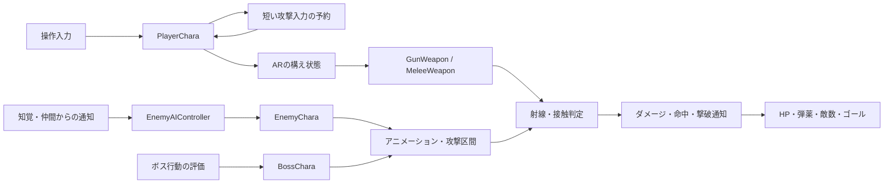

# Zombie Attack

### 射撃・アニメーション・敵の判断をつなげた、三人称ゾンビアクション

Pistol・AR・Knifeを切り替え、通常敵・中間ボス・ラストボスを倒して脱出する個人制作ゲームです。**C++によるプレイヤー制御、敵AI、攻撃判定とアニメーションの同期**を中心に制作しました。

狙った場所へ撃つこと、手足が届く瞬間に攻撃が当たること、敵が一斉に同じ行動を取らないことを重視しています。ゲームルールはC++で管理し、素材や演出の設定はUnreal Editor・Blueprint側で調整する構成です。

**[旧プレイ動画](https://drive.google.com/file/d/1ezazuAM-6t2Oc3je9asIbnAP9bNGCkFo/view) · [新プレイ動画](https://drive.google.com/file/d/1NP7d6GLB5NhSRxpCJDCnDE9Tzm09YqlL/view) ·　[担当範囲](#担当範囲) · [技術的に工夫した点](#技術的に工夫した点) · [問題と改善](#発生した問題と改善内容) · [主要コード](#特に見てほしいコード) · [検証](#検証と公開範囲)**

## 基本情報

| 項目 | 内容 |
| --- | --- |
| ジャンル | 三人称視点のゾンビアクション |
| 制作形態 | 個人制作 |
| 制作期間 | 約1.5か月（2025年9月22日〜2025年11月7日） |
| 継続改善 | 制作期間後も調整を継続。最新のローカル検証・パッケージ作成日：2026年10月10日 |
| 使用エンジン | Unreal Engine 5.7（ローカル検証：5.7.4） |
| 使用言語・環境 | C++、Visual Studio 2022、Windows |
| 主な使用技術 | AI Perception、Navigation System、AnimInstance、AnimMontage、AnimNotify、UMG、Niagara |
| 対応操作 | キーボード・マウス、XInputコントローラー |
| 公開内容 | ゲーム本体のC++ソース、設定、プロジェクト定義 |


### 直近の更新

2026年10月10日の更新です。以下のC++実装を公開ソースへ反映しています。マップとアニメーション資産の調整は、非公開のローカル完全版に含まれます。

- 武器切り替え・死亡時にナイフの次段予約を取り消し、操作禁止中の攻撃関連操作を制限。
- ドロップ品の種類を確定してから拾えるようにし、死亡後の拾得とゴール到達を無効化。
- 敗北時の敵削除が撃破数やゴール解放へ影響しないよう、死亡通知と画面遷移を整理。
- スタート・クリア・ゲームオーバーの人物の向き、カメラ、アニメーションと照明を調整。
- プレイヤー終了時の武器・HUD・タイマー・通知登録を片付け、カットシーン用カメラとBGMの終了処理を追加。
- ARの構えを上半身・下半身へ合成した後の両手の方向から、射撃中のキャラクターの向きを補正。武器BPの取り付け角度は維持。
- 敵の左右移動クリップを使う姿勢評価を追加し、足運びから求めた一周期の距離に移動速度と再生速度を合わせる。
- 攻撃担当の敵が射程の手前で止まる到着判定と、前の攻撃の終了通知が次の攻撃へ干渉する処理を修正。
- ChargeRush命中時の通知、一度だけの吹き飛ばし、命中後の突進停止を追加。
- 森の経路禁止領域を扱うクラスを追加。ローカルの本編マップでは道・広場を残して境界を配置し、突進・後退も制限。
- Unreal Engine 5.7.4でEditorビルド、自動テスト31件成功・0件失敗、Windows Shipping版の作成を確認。


## 担当範囲

### ゲーム本体の実装

- プレイヤーの移動、後退、カメラ、ジャンプ、体力、回復、死亡
- 三種類の武器、射撃、近接攻撃、リロード、武器切り替え
- ARの構えと発射条件、行動終了直前の入力受付
- 通常敵の巡回、知覚、追跡、捜索、回り込み、集団での攻撃調整
- 中間ボス・ラストボスの行動評価、攻撃パターン、射程判定
- 攻撃区間の接触判定、着弾・撃破のフィードバック
- 敵生成、生存数の管理、ゴール開放、ゲーム進行
- HP・弾薬・武器・敵数のHUD、三つのメニュー画面、導入カットシーン

### 素材との組み合わせ・調整

モデル、アニメーション、音源などの外部素材を組み込み、再生条件、照明、エフェクトの生成位置、UIとの接続を調整しています。**外部素材そのものの制作と、ゲームへ組み込む実装は区別しています。**

## 技術的に工夫した点

### 1. 射撃入力・構え・命中判定を分ける

ARは攻撃入力を受けても、構えが完了するまで発射を保留します。専用コンポーネントが構えの状態を管理し、Notifyと発射可能条件を照合して、Idle姿勢のまま撃つ状態を防ぎます。

キャラクターの基準正面だけでは、構えクリップと下半身を合成した際の角度差を解消できませんでした。構えが十分に混ざった後は、**評価済みの両手の方向をメッシュ座標で取得し、カメラの水平照準へ合わせる**ようにしています。武器の取り付け角度を変えず、ピストル・ナイフの補正処理とも分けています。

照準はカメラ中央から求めますが、**ダメージを決める射線は銃口から再計算**します。壁と敵を別々に調べて手前の衝突を採用し、カメラから敵が見えていても銃口側が遮られていれば壁に当たります。銃身が壁を突き抜けた場合は、体から銃口までの判定でも遮蔽物を確認します。

即時命中を使う武器では、表示用の弾から二重にダメージを与えず、着弾地点までの距離に合わせて表示時間を制限しています。

主要コード：[`PlayerCharaCombat.cpp`](Source/ZombieAttack/Player/PlayerCharaCombat.cpp)、[`PlayerRifleAnimationComponent.cpp`](Source/ZombieAttack/Components/RifleAnimation/PlayerRifleAnimationComponent.cpp)、[`WeaponAimTrace.cpp`](Source/ZombieAttack/Weapon/WeaponAimTrace.cpp)

### 2. 集団の判断と、一体ごとの攻撃を分ける

通常敵はAI Perceptionによる発見と、巡回・追跡・捜索・攻撃の状態を組み合わせています。接近ではプレイヤーの周囲へ向かう候補位置を使い、複数体が同じ位置へ押し寄せる状況を抑えます。

攻撃開始には周辺の敵の状態と開始間隔を考慮します。発見時も、近くの雑魚敵は一体が咆哮し、通知を受けた仲間は追跡へ移ります。咆哮の再生速度を変える際は停止時間も合わせ、動作途中で滑り始めないようにしています。

ボスは距離、視線、プレイヤーの移動・回復・リロード、直近の被ダメージ、行動履歴から候補を採点します。射程条件を満たす候補を選び、同じ技の反復にはペナルティを与えます。中間ボスとラストボスで評価の重みを変えています。これは**ゲーム内の条件と重みによる行動選択**であり、機械学習による判断ではありません。

主要コード：[`EnemyAIController.cpp`](Source/ZombieAttack/AIController/EnemyAIController.cpp)、[`EnemyCharaCombat.cpp`](Source/ZombieAttack/Enemy/EnemyCharaCombat.cpp)、[`BossUtilityAIComponent.cpp`](Source/ZombieAttack/AIController/BossUtilityAIComponent.cpp)

### 3. アニメーションの姿勢と攻撃区間を一致させる

通常の体の衝突と、攻撃によるダメージ判定を分離しています。攻撃用Notifyで受付区間を開閉し、その間だけ手足の移動に沿って判定します。一振りの中で同じ相手へ繰り返しダメージが入らないよう、命中済みの管理も行います。

敵の移動姿勢はC++のAnimInstanceでIdle・Walk・Runと左右移動を合成します。接地中の足の動きから一周期の移動距離を求め、実際の移動速度に合わせて再生速度を変えます。姿勢の並列評価中にActorへ直接アクセスしないよう、必要な速度はゲームスレッド側で取得します。

Mixamo素材の最上位ボーンが腰の場合、ルートを一律に固定するとパンチのひねりや屈伸まで失われます。そこで腰の回転と上下動は残し、カプセルから大きく離れる水平移動だけを制限しました。

攻撃の再開時には前のモンタージュの終了通知を切り離します。ChargeRushでは接触結果から吹き飛ばしと命中通知を発生させ、硬直へ移してから通知することで、同じ攻撃の二重発火を防ぎます。

主要コード：[`EnemyAnimInstance.cpp`](Source/ZombieAttack/Animation/Enemy/EnemyAnimInstance.cpp)、[`EnemyAttackTraceComponent.cpp`](Source/ZombieAttack/Enemy/Components/EnemyAttackTraceComponent.cpp)、[`AnimNotifyState_EnemyAttackCollision.cpp`](Source/ZombieAttack/Animation/AnimNotifyState_EnemyAttackCollision.cpp)

### 4. 入力の取りこぼしと演出による操作の重さを抑える

リロード、武器切替、発射間隔の終了直前に押した攻撃を、**0.18秒・一回分だけ予約**します。古い入力や別の武器への持ち越しは無効にし、ARはボタンを離した時点で予約を取り消します。銃自身でも発射間隔を確認し、連打や重複した呼び出しで設定以上に発砲しないようにしました。

撃破時の短いヒットストップは、連続撃破で延長しません。再発動まで実時間0.35秒の間隔を空け、停止中のカメラ入力は時間倍率を補償します。画面遷移や死亡で終了タイマーが消えても、元の時間倍率へ復帰できるようにしています。

主要コード：[`AttackInputBuffer.h`](Source/ZombieAttack/Components/Combat/AttackInputBuffer.h)、[`GunWeapon.cpp`](Source/ZombieAttack/Weapon/GunWeapon.cpp)、[`PlayerCharaVitals.cpp`](Source/ZombieAttack/Player/PlayerCharaVitals.cpp)

### 5. 進行・案内・演出を同じゲーム状態へつなぐ

全敵撃破をゴール開放と出口案内へ接続しています。敵を見失った場合の案内は、回転する三角だけでなく対象の種類・距離・左右や背後の方向を表示します。

導入カットシーンはゴールから脅威の強い敵、最後にプレイヤーへつなぐ構成です。再生中はHUDを隠し、終了後にフェード表示します。クロスヘアは登場演出から外しています。

スタート・クリア・オーバーは本編のプレイヤーと森林素材を使う3D背景とし、人物用のスポットライトを追加しました。HUDでは装填弾と予備弾を二重円で表し、装填弾が少なくなると数字の色を変えます。

主要コード：[`IntroCutsceneDirector.cpp`](Source/ZombieAttack/Cutscene/IntroCutsceneDirector.cpp)、[`GameFlowScene.cpp`](Source/ZombieAttack/UI/GameFlow/GameFlowScene.cpp)、[`EnemyLocatorWidget.cpp`](Source/ZombieAttack/UI/EnemyUI/EnemyLocatorWidget.cpp)

### 6. 生成したものの寿命を明確にする

Unreal EngineのGCによる回収と、ゲーム中に不要になったActorやUIの後片付けを分けています。プレイヤーの`EndPlay`では、所有武器の重複参照をまとめて破棄し、5種類のHUDをViewportから取り外して参照を解除します。予約攻撃・回復のタイマー、構え完了通知、リロード音も終了します。

カットシーン用カメラは、プレイヤー視点への補間が終わってから破棄します。Director自体が途中で破棄された場合にもカメラを残さず、自動破棄しないBGMはGameMode終了時に停止・破棄します。

専用の検証ではプレイヤー・武器・HUDの生成と終了を10回繰り返し、所有参照の解除とGC後の回収を確認しました。長時間プレイ中のメモリ使用量計測や、すべての外部素材のリーク検査まで完了したという意味ではありません。

主要コード：[`PlayerCharaVitals.cpp`](Source/ZombieAttack/Player/PlayerCharaVitals.cpp)、[`IntroCutsceneDirector.cpp`](Source/ZombieAttack/Cutscene/IntroCutsceneDirector.cpp)、[`GameFlowGameMode.cpp`](Source/ZombieAttack/UI/GameFlow/GameFlowGameMode.cpp)

### 7. 経路移動と、技による移動に同じ境界を使う

森の内部には敵用の経路禁止領域を設け、プレイヤーを止める見えない物理壁とは分けています。通常の経路探索だけでなく、経路を使わない突進・後退にも同じ境界を照合します。線分とカプセル半径を使うため、移動の終点だけを調べる方法で起きる境界の飛び越えも検出できます。

ローカルの本編マップでは219領域の経路不可と、開始地点から3つの戦闘広場・ゴールへの経路が残ることを検証しました。公開するのは境界を扱うC++コードで、配置済みマップは含みません。

主要コード：[`EnemyForestBlock.cpp`](Source/ZombieAttack/AIController/EnemyForestBlock.cpp)、[`BossCharaCombat.cpp`](Source/ZombieAttack/Enemy/BossChara/BossCharaCombat.cpp)

## 発生した問題と改善内容

| 問題 | 着目した原因・条件 | 実装した対応 |
| --- | --- | --- |
| ARが構える前に発射される | 入力と発射条件、姿勢の準備が一致しない | 専用状態管理と構え完了通知で発射を制限 |
| ARの構えが照準の外側を向く | 元クリップと合成後の姿勢に角度差がある | 評価済みの両手の方向を使ってキャラクターの水平角を補正 |
| 敵が目の前で停止して攻撃しない | 分散用の目的地と到着半径が攻撃射程より遠い | 攻撃担当は接触射程まで詰め、カプセル半径の二重加算を避ける |
| 横移動で敵の足が滑る | 前進用姿勢のまま左右へ動いている | 敵ごとの左右移動クリップと歩幅に基づく再生倍率を使用 |
| カメラから見える敵へ壁越しに命中する | 敵を優先する照準判定だけでダメージを確定 | 壁との前後比較、銃口と銃身側の遮蔽判定を追加 |
| 雑魚敵が同時に咆哮・攻撃する | 集団への通知が同じ行動開始につながる | 近隣の咆哮を一体へ限定し、攻撃開始の間隔を調整 |
| 敵の攻撃姿勢が崩れる・滑る | 腰のルート固定と移動要求、攻撃再生の競合 | 姿勢評価と移動停止を整理し、接触判定を攻撃区間へ限定 |
| 後退アニメーションが停止し、足運びと速度が合わない | ループ設定と移動速度・再生倍率の整合 | ループを明示し、接地中の足の速度を基準に後退を調整 |
| 行動終了直前の射撃入力が失われる | 操作不可中の入力をすべて破棄していた | 期限と装備番号を持つ一回分の入力予約を追加 |
| 連続撃破で操作が重く感じられる | ヒットストップの延長とカメラ入力への時間倍率 | 再発動間隔、カメラ入力補償、終了時の復帰処理を追加 |

上記は問題に対して実装した対応です。すべての配置や操作条件で解消を確認したという意味ではなく、検証範囲は末尾に記載しています。

## 戦闘処理の構成



処理の役割と通知の流れを示す概念図です。継承関係や全関数の呼び出しを網羅した図ではありません。

プレイヤーのMovement・Combat・Vitals・UI、敵とボスのCombat・Effectsは、**同じクラスの実装を用途別のcppへ分けたもの**です。一方、ARアニメーション、音声、命中フィードバック、敵の攻撃追跡はコンポーネントとして分離しています。`AttackInputBuffer`は短い予約情報を扱う構造体です。

## 特に見てほしいコード

最初は次の順に読むと、入力から戦闘結果までを追えます。

| 順番 | ファイル | 確認してほしい処理 |
| --- | --- | --- |
| 1 | [PlayerCharaCombat.cpp](Source/ZombieAttack/Player/PlayerCharaCombat.cpp) | 操作の受付、入力予約、ARの構え待ち、リロードとの競合防止 |
| 2 | [GunWeapon.cpp](Source/ZombieAttack/Weapon/GunWeapon.cpp) | 銃口の命中判定、二重ダメージ防止、発射間隔。射線比較は[WeaponAimTrace.cpp](Source/ZombieAttack/Weapon/WeaponAimTrace.cpp) |
| 3 | [EnemyAIController.cpp](Source/ZombieAttack/AIController/EnemyAIController.cpp) | 知覚から追跡・捜索への遷移、集団への通知、回り込み |
| 4 | [BossUtilityAIComponent.cpp](Source/ZombieAttack/AIController/BossUtilityAIComponent.cpp) | 状況の集約、攻撃候補の評価、行動履歴による反復抑制 |
| 5 | [EnemyCharaCombat.cpp](Source/ZombieAttack/Enemy/EnemyCharaCombat.cpp) | 攻撃開始条件、手足の接触区間、命中管理。姿勢評価は[EnemyAnimInstance.cpp](Source/ZombieAttack/Animation/Enemy/EnemyAnimInstance.cpp) |

<details>
<summary>リポジトリ構成を開く</summary>

```text
Source/ZombieAttack/
├─ Player/          操作・移動・戦闘・体力・HUDとの接続
├─ Weapon/          武器・射線判定
├─ Bullet/          弾の移動・衝突
├─ Enemy/           通常敵・生成・攻撃判定
│  ├─ BossChara/    ボスの行動・攻撃・エフェクト
│  └─ Components/   姿勢更新後の接触判定
├─ AIController/    知覚・追跡・集団行動・ボス行動評価
├─ Animation/       プレイヤー・敵の姿勢評価とNotify
├─ Components/      入力予約・音声・AR姿勢・命中演出
├─ UI/              HUD・メニュー・案内
├─ Cutscene/        導入演出とHUDの復帰
└─ Goal/            脱出地点の開放
Config/             入力・画面・パッケージ設定
```

</details>

## 操作方法

| 操作 | キーボード・マウス | コントローラー（XInput表記） |
| --- | --- | --- |
| 移動 | W / A / S / D | 左スティック |
| カメラ | マウス移動 | 右スティック |
| 攻撃・射撃 | 左クリック | RT |
| エイム | 右クリック長押し | LT |
| リロード | R | X |
| ジャンプ | Space | A |
| 回復 | H | Y または十字キー下 |
| Pistol / AR / Knife | 1 / 2 / 3 | 十字キー左 / 上 / 右 |
| 武器の順送り | マウスホイール | LB / RB |

ARは入手後に使用できます。S入力では正面を向いたまま後退します。
